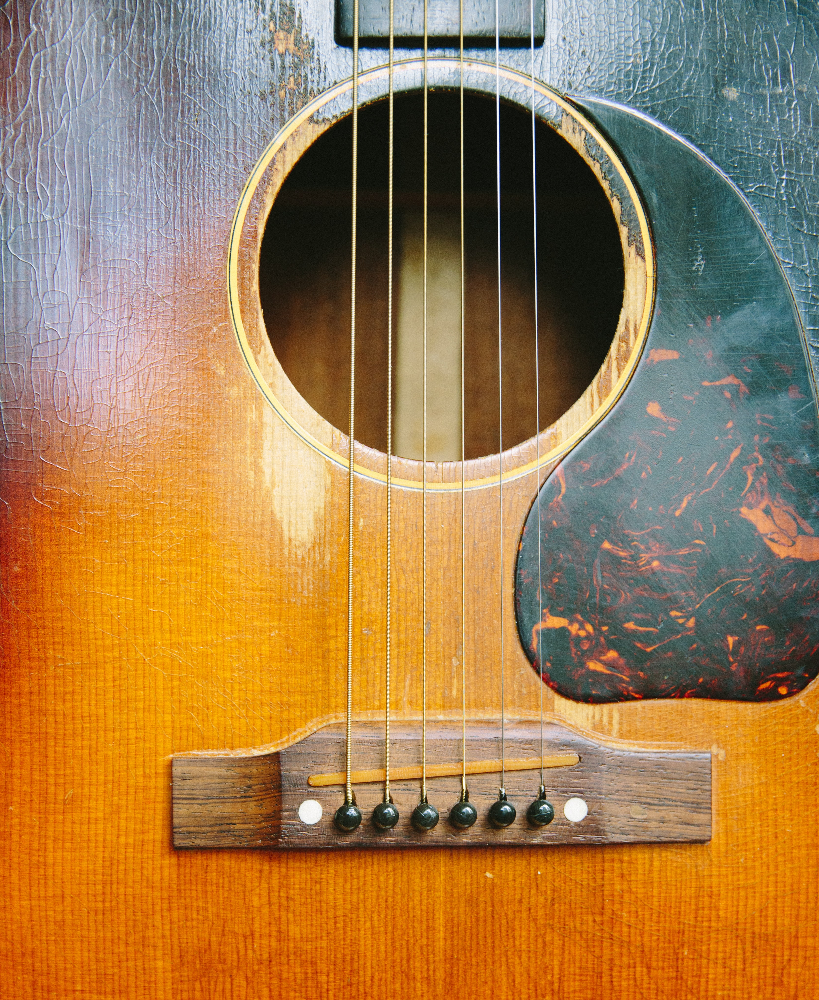

# 🎨 colortaker

<br>

 #### 🖼️ ➡️ 🖌️🎨

 <br>


Take an image and print a palette with the most prominent colors.

|Image|Palette|
|:---:|:---:|
|||

### Install and use the command line
```bash 
git clone
cd colortake
npm install
```

The command takes the arguments: path of your pic, the number of colors in the palette (remember needs to be a power of two: 2, 4, 8, ...) and the palette destination name

For example:
```bash
npm run getPalette --- gibson.jpg 4 palette.png
```
Will give you the example palette.

### Or use the module

```bash
npm install colortaker
```

```javascript
const {printPalette} = require('colortaker')
printPalette('guitar.jpg', 4, 'palette.png')
```

### The [Median cut](https://en.wikipedia.org/wiki/Median_cut) algorithm was implemented as follows:
1. Take an array of arrays containing RGB of each pixel ([[red, blue, green], [red, blue, green], etc])
2. Find the range of values for each of the three color channel accross pixels in the array
3. Take the channel with largest range
4. Find the median value for that channel
5. Split the pixels in array in two: below the median of that channel and above it
6. Repeat recursevily until we get N groups
7. Get average of each group

The number of colors desired needs to be a power of two. The number of times we are going perform a split of pixels would be = log(colors in palette) / log(2)

### Credits to:
 - <span>Guitar photo by <a href="https://unsplash.com/@copal?utm_source=unsplash&amp;utm_medium=referral&amp;utm_content=creditCopyText">CÔPAL</a> on <a href="https://unsplash.com/s/photos/guitar-gibson?utm_source=unsplash&amp;utm_medium=referral&amp;utm_content=creditCopyText">Unsplash</a></span>